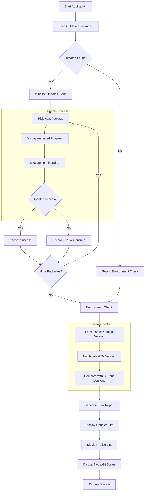

# Global Package Updater

CLI tool that validates globally installed npm packages, checks for available updates, and upgrades them sequentially to ensure stability. It also verifies whether newer versions of Node.js and Git are available.

Built in May 2026. This application automates the process of keeping your global development environment secure, consistent, and fully up to date with automated validation and incremental updates.

## Features

### Core Capabilities

- 📦 **Global NPM Updates**: Automatically detects and upgrades outdated global packages
- 🔄 **Sequential Upgrades**: Updates packages one by one to ensure system stability
- 🚀 **Progress Tracking**: Real-time animated loading bars and progress status for each update
- 🛠️ **Environment Check**: Verifies current Node.js and Git versions against the latest releases

### Technical Excellence

- 📊 **Detailed Reporting**: Comprehensive summary of updated packages and version changes
- 🧪 **Full Test Coverage**: Robust unit testing suite using Vitest with high coverage thresholds
- 🏗️ **Clean Architecture**: Built with TypeScript and organized into modular utility services

### Developer Experience

- 🎨 **Beautiful UI**: Colorful and informative console output using Chalk and Ora
- ⚡ **Easy Execution**: Windows-ready .bat script for quick desktop access
- 🔍 **Error Handling**: Gracefully catches and reports failed updates while continuing the process

## Getting Started

### Prerequisites

- Node.js (v20 or higher)
- pnpm (recommended) or npm
- Git (optional, for version checks)

### Installation

1. Clone the repository:

```bash
git clone https://github.com/orassayag/global-package-updater.git
cd global-package-updater
```

2. Install dependencies:

```bash
pnpm install
```

3. Build the project:

```bash
pnpm run build
```

### Quick Start

#### Run the Updater

```bash
pnpm start
```

#### Run with Desktop Script (Windows)

Execute the provided batch file:

```bash
.\globalPackageUpdater.bat
```

## Usage

### Running the Application

To start the global package update process, simply run:

```bash
pnpm start
```

This will launch the CLI which sequentially:

1. Scans for outdated global packages.
2. Prompts for updates (if configured).
3. Shows real-time progress for each installation.
4. Performs a final environment check for Node.js and Git.

### Command Line Options

- `pnpm start`: Standard update process.
- `pnpm run build`: Compile the TypeScript source code.
- `pnpm test`: Run the full test suite with coverage.

## Configuration

The application is designed to work out of the box with standard global npm configurations.

### Core Settings

- The script uses `npm outdated -g --json` to fetch outdated packages.
- Sequential updates are performed using `npm install -g <package-name>`.
- Node.js versions are checked via the official Node.js distribution API.
- Git versions are checked via the GitHub API.

### Customization

- To run in development mode with live reloading: `pnpm run dev`
- To skip caching during execution: `pnpm run start:no-cache`

See [INSTRUCTIONS.md](INSTRUCTIONS.md) for more details.

## Available Scripts

### Main Application

```bash
pnpm start              # Run the global package updater
pnpm run build          # Compile TypeScript to JavaScript
pnpm run lint           # Run ESLint for code quality
pnpm run format         # Format code using Prettier
```

### Testing Scripts

```bash
pnpm test               # Run all tests with coverage report
pnpm test:watch         # Run tests in watch mode
pnpm test:no-coverage   # Run tests without coverage report
pnpm test:ui            # Open Vitest UI for interactive testing
```

## Development

### Code Quality

To maintain high code quality, we use ESLint and Prettier:

```bash
pnpm run lint     # Check for linting errors
pnpm run format   # Format code using Prettier
```

### Testing Workflow

Always run tests before submitting changes:

```bash
pnpm test         # Run all tests
pnpm test:watch   # Watch mode for active development
```

## Best Practices

- **Check Before Update**: Always review the list of outdated packages before proceeding with major updates.
- **Node.js LTS**: It is recommended to stay on the latest LTS (Long Term Support) version of Node.js.
- **Backup Configuration**: While global packages are easily replaceable, ensure your global configuration files are backed up if they contain custom logic.
- **Run as Administrator**: On Windows, some global updates may require elevated permissions.

## Architecture

### Architecture Principles

1. **Sequential Execution**: Updates are performed one by one to ensure system stability and clear error tracking.
2. **Modular Service Layer**: Business logic is separated into utility services (`npm.ts`, `versionCheck.ts`).
3. **Robust Error Management**: Failed updates do not stop the entire process; they are collected and reported at the end.
4. **Test-Driven Reliability**: High test coverage ensures that core orchestration and parsing logic remain stable.

### Design Patterns

- **Orchestrator Pattern**: The `index.ts` entry point manages the high-level application flow.
- **Service Pattern**: Specialized utilities handle interaction with external APIs and the NPM CLI.
- **Logger Utility**: Standardized terminal output is managed through a central logger service.

### Directory Structure

```
global-package-updater/
├── src/
│   ├── __tests__/            # Unit test suite
│   ├── utils/                # Service layer (NPM, Version checks, Logger)
│   └── index.ts              # Application entry point
├── misc/                     # Project planning and reference
├── .vscode/                  # Editor configuration
├── globalPackageUpdater.bat  # Windows execution script
├── package.json              # Dependencies and scripts
├── tsconfig.json             # TypeScript configuration
└── vitest.config.ts          # Test runner configuration
```

## How It Works



1. **Initialization**: The monitor starts and prepares the environment for scanning.
2. **Outdated Check**: Executes `npm outdated -g` to identify global packages needing updates.
3. **Sequential Processing**:
   - Picks the next package from the list.
   - Displays an animated loader with current and target versions.
   - Executes the upgrade command.
4. **Error Management**: If an update fails, the error is recorded, and the script moves to the next package.
5. **Environment Validation**:
   - Fetches the latest Node.js version from the official API.
   - Fetches the latest Git version from GitHub tags.
   - Compares current versions using semver.
6. **Final Reporting**:
   - Lists all successfully updated packages.
   - Displays any errors encountered during the process.
   - Shows Node.js and Git status with manual update reminders if needed.

## Architecture Flow

1. **Orchestration Layer**: [index.ts] manages the overall execution flow and user feedback.
2. **NPM Service**: [npm.ts] handles communication with the NPM CLI for scanning and updating.
3. **Version Service**: [versionCheck.ts] communicates with external APIs to verify system tools.
4. **Logger Utility**: [logger.ts] provides standardized, color-coded terminal output.
5. **Test Suite**: [__tests__] ensures reliability through comprehensive unit testing.

## Email Validation Features

_(Note: This section is kept for structure as requested, but repurposed for Environment Validation)_

The environment validation service includes:

- **Version Comparison**: Uses semver logic to accurately detect newer releases.
- **Node.js API Integration**: Directly queries official Node.js distribution lists.
- **GitHub API Integration**: Checks the latest stable Git tags.
- **Manual Update Alerts**: Provides clear instructions for tools that cannot be auto-updated.

## Built With

- [Node.js](https://nodejs.org/) - JavaScript runtime environment
- [Chalk](https://github.com/chalk/chalk) - Terminal string styling
- [Ora](https://github.com/sindresorhus/ora) - Elegant terminal spinners
- [Semver](https://github.com/npm/node-semver) - Semantic versioning parser
- [Vitest](https://vitest.dev/) - Next generation testing framework

## Contributing

We welcome contributions! Please see [CONTRIBUTING.md](CONTRIBUTING.md) for details on our code of conduct and the process for submitting pull requests.

## Support

For support, please open an issue on the GitHub repository or contact the author directly.

## License

This project is licensed under the MIT License - see the [LICENSE](LICENSE) file for details.

## Author

- **Or Assayag** - _Initial work_ - [orassayag](https://github.com/orassayag)
- Or Assayag <orassayag@gmail.com>
- GitHub: https://github.com/orassayag
- StackOverflow: https://stackoverflow.com/users/4442606/or-assayag?tab=profile
- LinkedIn: https://linkedin.com/in/orassayag

## Acknowledgments

- Built for educational and research purposes
- Inspired by the need for a simple, sequential global package updater
- Uses official Node.js and GitHub APIs for version checks
