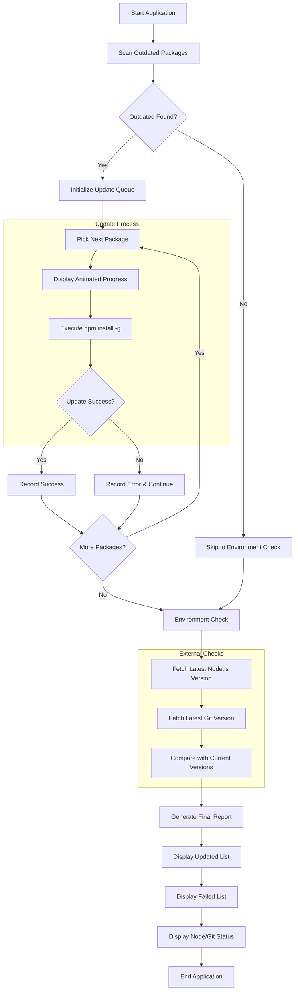

# global-package-updater

CLI tool that validates globally installed npm packages, checks for available updates, and upgrades them sequentially to ensure stability. It also verifies whether newer versions of Node.js and Git are available.

Built in May 2026. This application automates the process of keeping your global development environment secure, consistent, and fully up to date with automated validation and incremental updates.

## Features

- � **Global NPM Updates**: Automatically detects and upgrades outdated global packages
- 🔄 **Sequential Upgrades**: Updates packages one by one to ensure system stability
- 🚀 **Progress Tracking**: Real-time animated loading bars and progress status for each update
- �️ **Environment Check**: Verifies current Node.js and Git versions against the latest releases
- �️ **Error Handling**: Gracefully catches and reports failed updates while continuing the process
- 📊 **Detailed Reporting**: Comprehensive summary of updated packages and version changes
- 🧪 **Full Test Coverage**: Robust unit testing suite using Vitest with high coverage thresholds
- � **Clean Architecture**: Built with TypeScript and organized into modular utility services
- 🎨 **Beautiful UI**: Colorful and informative console output using Chalk and Ora
- ⚡ **Easy Execution**: Windows-ready .bat script for quick desktop access

## Getting Started

### Prerequisites

- Node.js (v20 or higher)
- pnpm (recommended) or npm
- Git (optional, for version checks)

### Installation

1. Clone the repository:

```bash
git clone https://github.com/orassayag/global-package-updater.git
cd global-package-updater
```

2. Install dependencies:

```bash
pnpm install
```

3. Build the project:

```bash
pnpm run build
```

### Quick Start

#### Run the Updater

```bash
pnpm start
```

#### Run with Desktop Script (Windows)

Execute the provided batch file:

```bash
.\globalPackageUpdater.bat
```

## Configuration

The application is designed to work out of the box with standard global npm configurations.

### Core Settings

- The script uses `npm outdated -g --json` to fetch outdated packages.
- Sequential updates are performed using `npm install -g <package-name>`.
- Node.js versions are checked via the official Node.js distribution API.
- Git versions are checked via the GitHub API.

### Customization

- To run in development mode with live reloading: `pnpm run dev`
- To skip caching during execution: `pnpm run start:no-cache`

See [INSTRUCTIONS.md](INSTRUCTIONS.md) for more details.

## Available Scripts

### Main Application

```bash
pnpm start              # Run the global package updater
pnpm run build          # Compile TypeScript to JavaScript
pnpm run lint           # Run ESLint for code quality
pnpm run format         # Format code using Prettier
```

### Testing Scripts

```bash
pnpm test               # Run all tests with coverage report
pnpm test:watch         # Run tests in watch mode
pnpm test:no-coverage   # Run tests without coverage report
pnpm test:ui            # Open Vitest UI for interactive testing
```

## Project Structure

```
global-package-updater/
├── src/
│   ├── __tests__/            # Unit test suite
│   │   ├── index.test.ts     # Main orchestration tests
│   │   ├── npm.test.ts       # NPM utility tests
│   │   └── versionCheck.test.ts # Environment check tests
│   ├── utils/                # Service layer
│   │   ├── logger.ts         # Console output utility
│   │   ├── npm.ts            # NPM command orchestration
│   │   └── versionCheck.ts   # Node.js and Git version logic
│   └── index.ts              # Application entry point
├── misc/                     # Project planning and reference
├── .vscode/                  # Editor configuration
├── globalPackageUpdater.bat  # Windows execution script
├── package.json              # Dependencies and scripts
├── tsconfig.json             # TypeScript configuration
└── vitest.config.ts          # Test runner configuration
```

## How It Works



1. **Initialization**: The monitor starts and prepares the environment for scanning.
2. **Outdated Check**: Executes `npm outdated -g` to identify global packages needing updates.
3. **Sequential Processing**:
   - Picks the next package from the list.
   - Displays an animated loader with current and target versions.
   - Executes the upgrade command.
4. **Error Management**: If an update fails, the error is recorded, and the script moves to the next package.
5. **Environment Validation**:
   - Fetches the latest Node.js version from the official API.
   - Fetches the latest Git version from GitHub tags.
   - Compares current versions using semver.
6. **Final Reporting**:
   - Lists all successfully updated packages.
   - Displays any errors encountered during the process.
   - Shows Node.js and Git status with manual update reminders if needed.

## Architecture Flow

1. **Orchestration Layer**: [index.ts] manages the overall execution flow and user feedback.
2. **NPM Service**: [npm.ts] handles communication with the NPM CLI for scanning and updating.
3. **Version Service**: [versionCheck.ts] communicates with external APIs to verify system tools.
4. **Logger Utility**: [logger.ts] provides standardized, color-coded terminal output.
5. **Test Suite**: [__tests__] ensures reliability through comprehensive unit testing.

## Email Validation Features

_(Note: This section is kept for structure as requested, but repurposed for Environment Validation)_

The environment validation service includes:

- **Version Comparison**: Uses semver logic to accurately detect newer releases.
- **Node.js API Integration**: Directly queries official Node.js distribution lists.
- **GitHub API Integration**: Checks the latest stable Git tags.
- **Manual Update Alerts**: Provides clear instructions for tools that cannot be auto-updated.

## Built With

- [Node.js](https://nodejs.org/) - JavaScript runtime environment
- [Puppeteer.js](https://pptr.dev/) - Headless browser automation
- [MongoDB](https://www.mongodb.com/) - NoSQL database
- [Inquirer.js](https://github.com/SBoudrias/Inquirer.js) - Interactive command line user interfaces

## License

This application has an MIT license - see the [LICENSE](LICENSE) file for details.

## Author

- **Or Assayag** - _Initial work_ - [orassayag](https://github.com/orassayag)
- Or Assayag <orassayag@gmail.com>
- GitHub: https://github.com/orassayag
- StackOverflow: https://stackoverflow.com/users/4442606/or-assayag?tab=profile
- LinkedIn: https://linkedin.com/in/orassayag
- LinkedIn: [Or Assayag](https://il.linkedin.com/in/orassayag)

## Acknowledgments

- Built for educational and research purposes
- Respects robots.txt and implements rate limiting
- Uses user-agent rotation to avoid detection
- Implements polite crawling practices

## License

This project is licensed under the MIT License - see the [LICENSE](LICENSE) file for details.

- Built to demonstrate advanced Puppeteer.js crawling and validation techniques.
